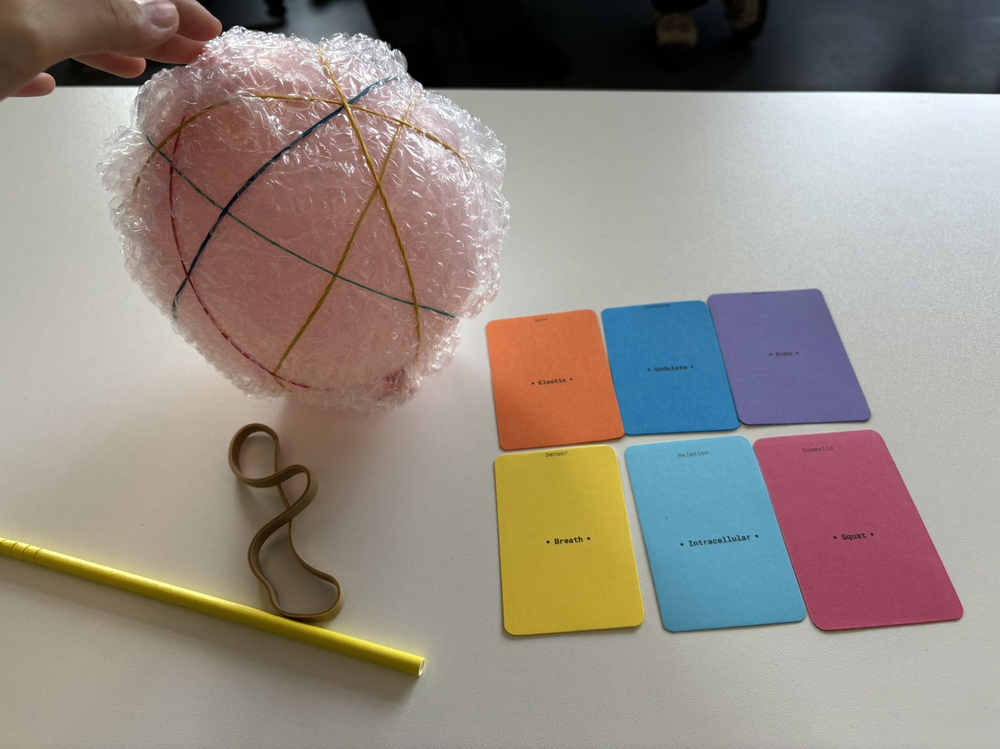
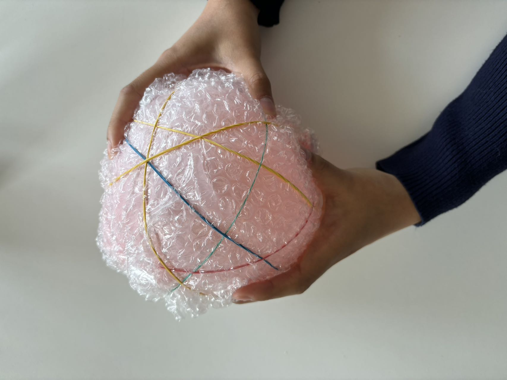

# wkshp3: Soft Robotics
This markdown file is mainly general notes and quick idea explorations during classes.

## 2024-10-14

### General wkshp brief and concept

hardware → software  
more adaptive  
more human, jump out from the typical one 
inspiration from nature, more organic  
interaction between humans and robotics 
beyond labor (don’t do labor), domestic lives 家庭生活？ more relationship 
novel combinations 
application and new usage 
paper prototype, the jury 
3D file for industrial/product design 

### References and possible tracks

[feminism](https://www.feministinternet.com/), [the good robot](https://www.thegoodrobot.co.uk) 
gestures, movements 
companion 
[MIT_personalrobots](https://www.media.mit.edu/groups/personal-robots/overview/) 
[anima](https://claire-lea.com/projects/anima-i) 
[pinaffo-pluvinage](https://pinaffo-pluvinage.com/) 
biological systems 

### Soft Robotics

robots rigides, rigid robots, 刚性机器人 
bioinspiration, octopus 
use of soft materials 
deformable structure 

### Plastic Worlds - Julien Wacquez

hard and soft; rigid and plastic; stiff and flexible 
sci-fi, Becky Chambers-a cozy revolution in sci-fi, *To be Taught, if Fortunate (2019), A Psalm of the Wild Built (2021)*
cyborg 
references: the interesting design parts in movies(avatar, terminator-liquids), animations, games(Metal gear solid 4) 

### Deep materiology and soft world - Emmanuel Docu…

we design softer ways to … 
material: sand 
hard → soft → ethereous? 
back to future 
go to zoo or 水族馆 and think about what is their intelligence. inner things, creatures 
12 proposals, 10-extension of the human body 

## 2024-10-15

[cards](https://docs.google.com/spreadsheets/d/1GpCnHk2lfN9w5SjtVgf-jJAkr7sh4xHUlj76pYzaXSo/edit?exids=71471476%2C71471470&gid=0#gid=0) [google sheet of the keywords](https://docs.google.com/spreadsheets/d/1GpCnHk2lfN9w5SjtVgf-jJAkr7sh4xHUlj76pYzaXSo/edit?exids=71471476%2C71471470&gid=0#gid=0)

### Prototype brainstorming1

from the **Solitude**, human beings increasingly need the accompany of pets, and what about pets? pets have Separation Anxiety, and there’s a Pet Attachment Theory, Biophilia Hypothesis (亲生命假说) 
a soft robotics that soft and furry, the entire body is made up of several strips, it **Glides** and move like **Waves**, less active more passive, stay and wrap in home and transfer any furniture into a “cat climbing frame” thing, would **Purr** when fill pressed (the **Tension** sensor), the interaction could be in purposed or not. 

### Prototype brainstorming2

undulate 波动 elastic 松紧带 squat 蹲，矮胖 intracellular 
art therapy, a support (size flexible, a pillow or a cup size or bed) to your body and mental health, is senses the **Breath, Undulate,** 
title: **holding your breath**  

domestic spaces: 

functional areas, spacial areas;  
related to human life and culture, home, social relation, identities, not just physical but dynamic space; 
embody a duality, represent both intimate family arrangements and sites for inequality [为什么我的男友和闺蜜不能同时看裸体 - 概念 补] 
[on slides more keywords, circulation, tracks-narrations] 

find your zone of intervention

observation start: room/shared apartments - the identities of private place and shared/public places;  during COVID, the lockdown brings to the room, 私人的空间被挤压成公共空间 

gather material and putting topics by side

## 2024-10-16

start to think about any softness that you could be inspired by
Next Monday have the area set 
Friday 1pm, 5 mins pre

## 2024-10-18

[itisasifyouweredoingwork](https://pippinbarr.com/itisasifyouweredoingwork/) 
[github repositories of it](https://github.com/pippinbarr/itisasifyouweredoingwork)
use GitHub as the documentation place  
learning how to do documentation in github

## 2024-10-21

Iteration: explore a lot of different ideas, different versions  
Interaction: communication and engagement, people <-> automated systems, refer [*The concept of “interaction” in debates on human–machine interaction*](https://www.nature.com/articles/s41599-023-02060-8) 

WHO interacts? 
HOW do theese subjects interact?  
for WHAT REASON is interaction taking place? 
under WHAT CONDITIONS (WHERE) is interaction taking place? 

ONE key interaction, the simpel the interesting, the better 
refer: [teenage engineering](https://teenage.engineering/), [play date](https://play.date/), *Katamari Damacy* (video game) 
AGENCY: user ability to perform meaningful actions and have a sense of control; their choices translate into real changes;actively engage; create a sense that user decisions matter and impact the outcome 
PERSONALITY: how you define the soft robotics, refer [superflux](https://superflux.in/#): [Our friends x electric](https://superflux.in/index.php/work/friends-electric/#) 
FEEDBACK 
INPUT/OUTPUT 

### Exercise 1
list of possible areas or specific situations where your soft robot could be used or interact within a home environment, focus on where the robot could be placed* and how it might interact with the surroundings 

Places
- corner, a place easy to be ignored but always importation for useless things
- door/wall/anyplace can hang things, these are more like free spaces in domestic place that must exist but most of the space on them is not used as the main function (eg, door mainly using the handle but not on door), so its available and free for adaption
- on table, jsut as a normal object
- under the bed or by bedside, ignored, random, handy
- in closet as a canbinet, most of them are turned into that way
- along the daily routine

### Exercise 2
list of potential interactions and geed back mechanism of the robot 

Interaction, input/output
- grow, generate into shapes that hold handy things, flexible
- play sound, to remind, or to show the existence
- light, shine as the lamp but function in different way
- heat, a little bit critical, but to avoid the handy and random use
- viberate, can be either 1 of upper 3
- movement, move following the usual daily routine of the owner of the house, to become handy 
- connect, connect with all the misused objects, contact? communicate with them or link them together, like the main brain of the IoT
- time length of the owner staying in room or putting something on it
- message
- gesture

### Exercise 3
a short para, what the soft robot does, where it resides in the home and who it interact with. feed text to an AI and begin an iterative process to refine your concept -> quick prototypes, key points get 
AIs can be used: huggingChat, chatGPT, v0, Gemini, etc. 

>robot prompt