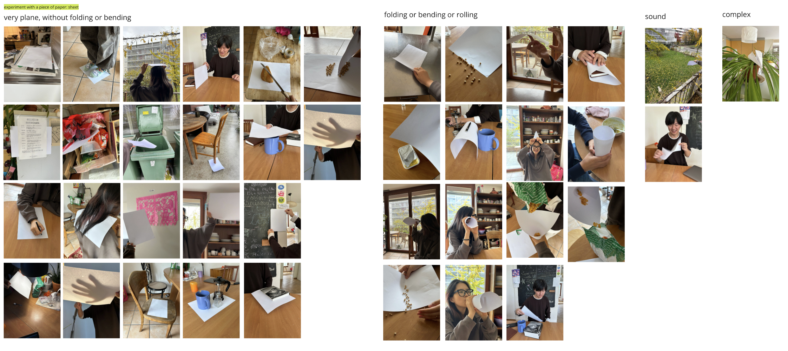

# Liuliu
- Soft Robots
- Master Media Design + O2R

## Project title 
Coneic

## Research Question / area of research
How can objects create new functions through human interpretation?

## Pitch
My project is a collection of playful cone-shaped soft robots that inspire people to recreate and evolve through user interaction.

## Prototyping research
- observation: the misbehavioring objects in my room

- research and references: 
    - design noir

    - [Jasper Morrison](https://jaspermorrison.com/publications/essays/the-unimportance-of-form)
    - Michel De Certeau’s [The Practice of Everyday Life](https://en.wikipedia.org/wiki/The_Practice_of_Everyday_Life) [pdf](https://monoskop.org/images/2/2a/De_Certeau_Michel_The_Practice_of_Everyday_Life.pdf)(Creative Consumption, personalized usage -> secondary production)
- experiments on the forms: what makes people use it? motion, visual effect, force, stability, usage

- then prototype and interactions, decide to make it playful and have the goal that it can always surprise the users, more in the user scenario part

//

Describe in a short paragraph (~500 chars) the research that you have conducted around your prototypes. What were your intentions? What are the several forms you looked into? What were the different interactions you tried? 

## Your key prototype
My project is a collection of playful, cone-shaped soft robots. My prototype is this collection of cones that react uniquely to different interactions, inspiring users to use, recreate, and evolve their functions. They are rooted in unintentional design and user innovation, inviting secondary production, and encouraging users to shape their own stories and bring them to life. 

## User scenario
video demos
> electronics/joystickcontrolLED/IMG_3614.MOV
> electronics/potentiometercontrolServo/IMG_3672.MOV

//
+ screenshot of the interaction list
+ storyboard

## Next Steps
- Adding and designing more interactions
- Enriching the behind and playful stories
- Combining and arranging the electronics with the prototype

todo:
- [x]  take a pic of the paper prototypes
- [ ]  regenerate pluge in the touchpad arduino board tomorrow, the several different functions
- [ ]  text in the research, tmr
- [ ]  storyboard and list, tmr