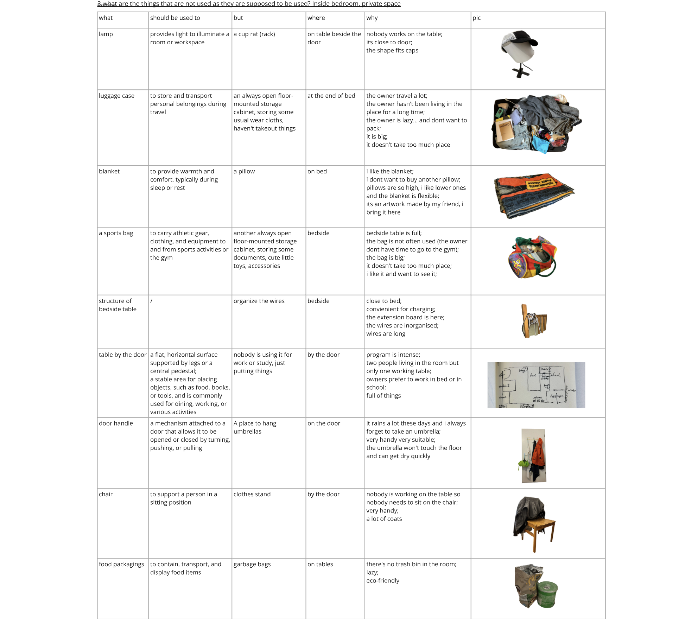

# Liuliu
- Soft Robots
- Master Media Design + O2R

## Area of intervention
The misbehaviored/misused objects in domestic spaces

## Research Question
How do objects earse the original identities and gain new ones through human interaction? and what role does space play in this transformation?

## Research
My very first observation was simply start from my private room, listing and thinking a little about all the objects inside that I see and live with everyday.

interview with roommate and some appartment mates
observations

concept/reference research

Describe in a short paragraph (~1000 chars) the research that you have conducted around your core questions. Mentions your research methods: interviews, observations, questionnaires, et cætera. Illustrate each method with corresponding data, photo, sketches, audio, movies, etc. You can put a lot of elements here, but please curate the most illustrative materials.

## Insights
- Objects in domestic spaces can gain new, unintentional identities through human interaction, and the new "misusage" is valuable or not is decided by the user.
- An object's identity and utility can be dynamically shaped by the presence and actions of people in a space

## First ideas & prototypes
Show three of your prototypes.

### 1. the misbehavior: from intentional+object to another intentional+object 
- **Where**: This robot can be placed on a tabletop, bedside, or anywhere one might typically put a lamp. 
- **Who**: It attracts those interested in playful, experimental objects that challenge the routine definition of objects in the home.
- **What**: The robot is a soft and pliable structure shaped like a traditional lamp. However, instead of providing light, it has multiple other alternative functions/behaviors. Its "misbehavior" lies in the tension between its lamp-like appearance and its unexpected behaviors, encouraging users to explore what it can actually do and rethink about the objects in domestic spaces.
- **How**: Users can interact with it by attempting to "treat" it like a lamp — try switching it on but only to find it doesn’t produce light but reacts in other ways. The robot might emit a soft hum or gently vibrate, or offer warmth by slightly heating up, or spread some nice smelled perfume, or grow to cover the object putting on that. Users learn through experimentation, exploring various functions as it responds to touch, weight, or movement around it.
- **Why**: The concept explores the misleading designs, inspired by the misbehavior objects people designed in their room. By taking a familiar form/shape and purposefully shifting its functionality, the robot encourages users to challenge their assumptions about everyday domestic objects.

Short paragraph (~250 chars) describing the prototype.

+ One photo of the prototype (can be gif animation, or static)
+ One storyboard of the prototype
+ (Optional) Audio
+ (Optional) Video

### 2. from unintentional+space to intentional+spaces 
- **Where**: It can exist in any part of a domestic space, depending on the users' needs and decisions.
- **Who**: It’s intended for users who enjoy transforming spaces.
- **What**: This is a soft, moldable robotic capable of changing both shape and color through simple touch gestures, like tapping or pressing. Once a user set the color and places it in a specific space—like a corner, tabletop, or shelf—it responds by creating an ambient landscape that visually reflects its new setting, using lighting effects to transform the surrounding area.
- **How**: Users touch the object, control its color by tapping gestures. For example, tapping it twice might shift it to a soft red and when placed the red mode robot in a corner, the object’s sensors analyze the location and generate a physical landscape, emitting an ambient light that fills the area with a subtle landscape effect. Tapping three times, then it becomes yellow and put it on a table, it will reshape itself into a concave. 
- **Why**: It provides users a way to personalize their environment intentionally, transforming unremarkable or ignored spaces into small landscapes. 

Short paragraph (~250 chars) describing the prototype.

+ One photo of the prototype (can be gif animation, or static)
+ One storyboard of the prototype
+ (Optional) Audio
+ (Optional) Video

### 3. from unintentional+object to (un)intentional+space
- **Where**: It could exist in any place in the domestic space, essentially in the part that may be messy or in need of spatial reorganization or more space.
- **Who**: It’s intended for individuals who may struggle to organize items, and want to open up space. Also appealing for people who enjoy playful things or want objects that adapt to their evolving living habits.
- **What**: It looks like only simple 3D shapes and it can autonomously reshape itself.It’s a "restoring space" robot that doesn’t eliminate mess but adapts to it, redefining functionality through unintentional design.
- **How**: When sensing the movement or thrown by users and placed over a mess or a pile of things, it fills gaps between them, and scans and understands the contour of the surface they are placed on. After detecting the underlying shapes, it molds/reshapes itself to provide a new layer on top, opens up the original (un)intentional space. Users get visual and tactile feedback as it extends and molds itself.
- **Why**: get inspired from the always open luggage which is opening up new spaces for me. The robotic doesn't aim to clean or organize but instead adapts to the existing state. 

Short paragraph (~250 chars) describing the prototype.

+ One photo of the prototype (can be gif animation, or static)
+ One storyboard of the prototype
+ (Optional) Audio
+ (Optional) Video

## Next Steps
In one sentence, describe what you will focus on next.