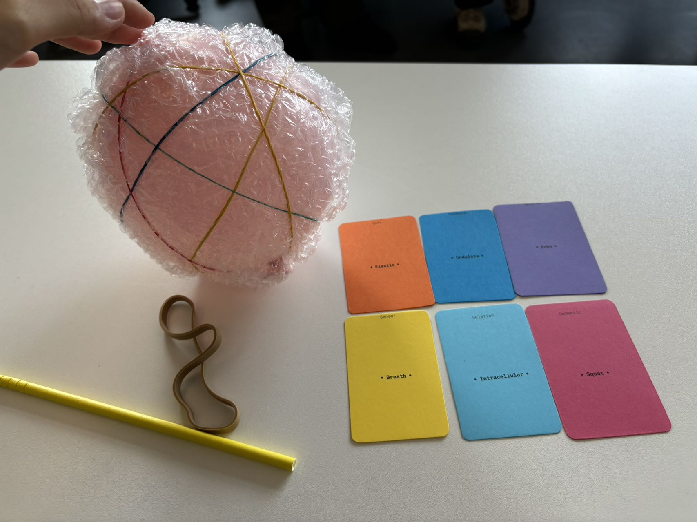
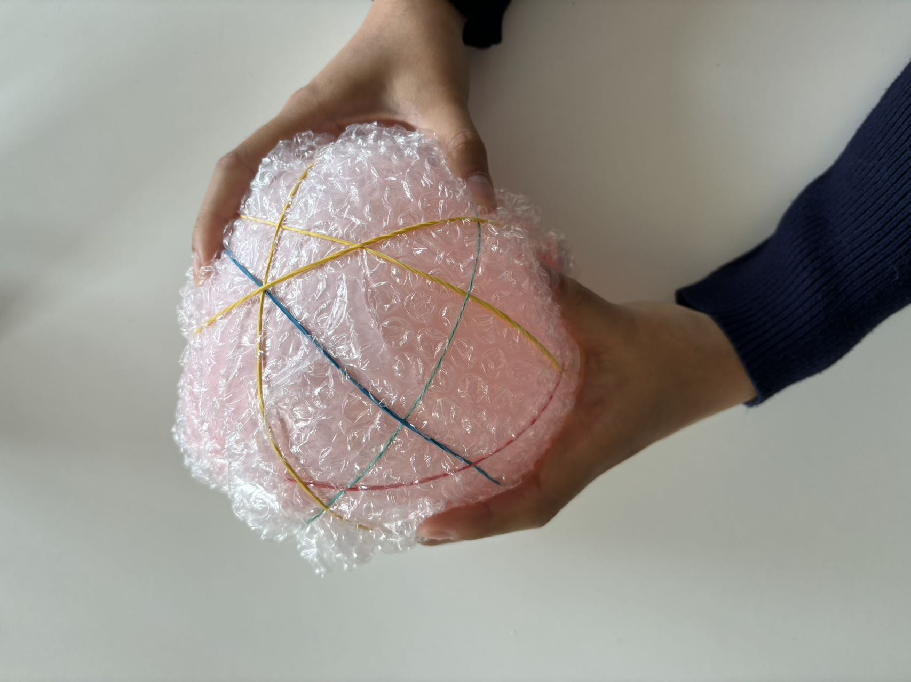
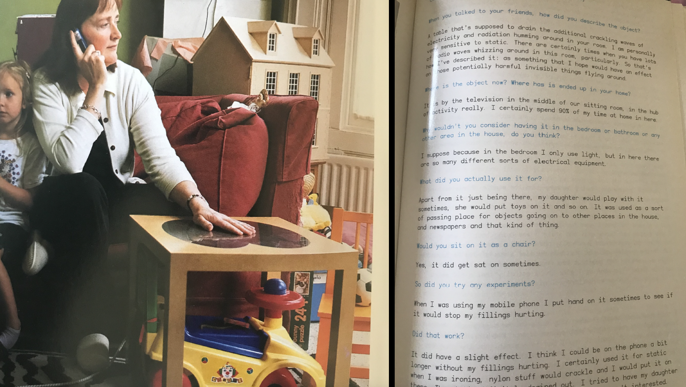

# wkshp3: Soft Robotics
This markdown file is mainly general notes and quick idea explorations during classes.

## 2024-10-14

### General wkshp brief and concept

hardware → software  
more adaptive  
more human, jump out from the typical one 
inspiration from nature, more organic  
interaction between humans and robotics 
beyond labor (don’t do labor), domestic lives 家庭生活？ more relationship 
novel combinations 
application and new usage 
paper prototype, the jury 
3D file for industrial/product design 

### References and possible tracks

[feminism](https://www.feministinternet.com/), [the good robot](https://www.thegoodrobot.co.uk) 
gestures, movements 
companion 
[MIT_personalrobots](https://www.media.mit.edu/groups/personal-robots/overview/) 
[anima](https://claire-lea.com/projects/anima-i) 
[pinaffo-pluvinage](https://pinaffo-pluvinage.com/) 
biological systems 

### Soft Robotics

robots rigides, rigid robots, 刚性机器人 
bioinspiration, octopus 
use of soft materials 
deformable structure 

### Plastic Worlds - Julien Wacquez

hard and soft; rigid and plastic; stiff and flexible 
sci-fi, Becky Chambers-a cozy revolution in sci-fi, *To be Taught, if Fortunate (2019), A Psalm of the Wild Built (2021)*
cyborg 
references: the interesting design parts in movies(avatar, terminator-liquids), animations, games(Metal gear solid 4) 

### Deep materiology and soft world - Emmanuel Docu…

we design softer ways to … 
material: sand 
hard → soft → ethereous? 
back to future 
go to zoo or 水族馆 and think about what is their intelligence. inner things, creatures 
12 proposals, 10-extension of the human body 

## 2024-10-15

[cards](https://docs.google.com/spreadsheets/d/1GpCnHk2lfN9w5SjtVgf-jJAkr7sh4xHUlj76pYzaXSo/edit?exids=71471476%2C71471470&gid=0#gid=0) [google sheet of the keywords](https://docs.google.com/spreadsheets/d/1GpCnHk2lfN9w5SjtVgf-jJAkr7sh4xHUlj76pYzaXSo/edit?exids=71471476%2C71471470&gid=0#gid=0)

### Prototype brainstorming1

from the **Solitude**, human beings increasingly need the accompany of pets, and what about pets? pets have Separation Anxiety, and there’s a Pet Attachment Theory, Biophilia Hypothesis (亲生命假说) 
a soft robotics that soft and furry, the entire body is made up of several strips, it **Glides** and move like **Waves**, less active more passive, stay and wrap in home and transfer any furniture into a “cat climbing frame” thing, would **Purr** when fill pressed (the **Tension** sensor), the interaction could be in purposed or not. 

### Prototype brainstorming2

undulate 波动 elastic 松紧带 squat 蹲，矮胖 intracellular 
art therapy, a support (size flexible, a pillow or a cup size or bed) to your body and mental health, is senses the **Breath, Undulate,** 
title: **holding your breath**  

### Domestic spaces: 

functional areas, spacial areas;  
related to human life and culture, home, social relation, identities, not just physical but dynamic space; 
embody a duality, represent both intimate family arrangements and sites for inequality [为什么我的男友和闺蜜不能同时看裸体 - 社会学的解读：场景崩塌+角色冲突，不同的人扮演的角色不同，而裸体在任意一种关系中都有其排他性和亲密性，两个场景彼此独立保持便捷，打破了就会带来角色认知冲突] 
[on slides more keywords, circulation, tracks-narrations] 

find your zone of intervention

observation start: room/shared apartments - the identities of private place and shared/public places;  during COVID, the lockdown brings to the room, 私人的空间被挤压成公共空间 

gather material and putting topics by side

## 2024-10-16

start to think about any softness that you could be inspired by
Next Monday have the area set 
Friday 1pm, 5 mins pre

## 2024-10-18

[itisasifyouweredoingwork](https://pippinbarr.com/itisasifyouweredoingwork/) 
[github repositories of it](https://github.com/pippinbarr/itisasifyouweredoingwork)
use GitHub as the documentation place  
learning how to do documentation in github

## 2024-10-21

Iteration: explore a lot of different ideas, different versions  
Interaction: communication and engagement, people <-> automated systems, refer [*The concept of “interaction” in debates on human–machine interaction*](https://www.nature.com/articles/s41599-023-02060-8) 

WHO interacts? 
HOW do theese subjects interact?  
for WHAT REASON is interaction taking place? 
under WHAT CONDITIONS (WHERE) is interaction taking place? 

ONE key interaction, the simpel the interesting, the better 
refer: [teenage engineering](https://teenage.engineering/), [play date](https://play.date/), *Katamari Damacy* (video game) 
AGENCY: user ability to perform meaningful actions and have a sense of control; their choices translate into real changes;actively engage; create a sense that user decisions matter and impact the outcome 
PERSONALITY: how you define the soft robotics, refer [superflux](https://superflux.in/#): [Our friends x electric](https://superflux.in/index.php/work/friends-electric/#) 
FEEDBACK 
INPUT/OUTPUT 

### Exercise 1
list of possible areas or specific situations where your soft robot could be used or interact within a home environment, focus on where the robot could be placed* and how it might interact with the surroundings 

Places
- corner, a place easy to be ignored but always importation for useless things
- door/wall/anyplace can hang things, these are more like free spaces in domestic place that must exist but most of the space on them is not used as the main function (eg, door mainly using the handle but not on door), so its available and free for adaption
- on table, jsut as a normal object
- under the bed or by bedside, ignored, random, handy
- in closet as a canbinet, most of them are turned into that way
- along the daily routine

### Exercise 2
list of potential interactions and geed back mechanism of the robot 

Interaction, input/output
- grow, generate into shapes that hold handy things, flexible
- play sound, to remind, or to show the existence
- light, shine as the lamp but function in different way
- heat, a little bit critical, but to avoid the handy and random use
- viberate, can be either 1 of upper 3
- movement, move following the usual daily routine of the owner of the house, to become handy 
- connect, connect with all the misused objects, contact? communicate with them or link them together, like the main brain of the IoT
- time length of the owner staying in room or putting something on it
- message
- gesture
- adapt, when thrown onto some messy things or corner, 

### Exercise 3
Using your ideas from exercises 1 and 2, write a short paragraph in markdown that describes what your soft robot does, where it resides in the home, and who it interacts with. Feed this text to an AI and begin an iterative process to refine your concept.
Following this, create a series of quick prototypes that summarize the key points from your concept and your conversations with the AI. 
AIs can be used: huggingChat, chatGPT, v0, Gemini, etc. 

>conversation with ChatG > ChatG.md

**Comments from profs (tutorial notes):** 
goes too fast, we dont need to see what the project looks like now 
go less general but put the interesting keywords  
"misusing" wrong uses  
misused robots?/gestures, the robot itself is misused  
a wrong intention in the first time  
hacking, hijack, a creative use if not the official use, personalized use
references  
people doing stupid things 
more the gesture, interaction, ... 
repurposing 
try doing a disign fiction: collecting "i have a little jellyfish robot designed in 2026, ... " sci-fi way  
not used， wired 荒诞的 
go into a future background conversation 

**Do a little research here for some ideas:** 
[Robots Failing Compilation](https://youtu.be/xl0i56oYGLE?si=Bgk-Xs5wg0kBDqmK) 
hackers gaining control over household cleaning robots, using them to shout racist slurs [report link](https://www.forbes.com/sites/larsdaniel/2024/10/16/racist-spy-robots--hackers-hijacked-vacuums-to-yell-racial-insults/) 
[Robot gets hilariously abused](https://youtu.be/0VgxAnZKM14?si=mJIhrU1QpjsDyavn) 
[PUTPUT](https://www.instagram.com/putput.dk?utm_source=ig_web_button_share_sheet&igsh=ZDNlZDc0MzIxNw==) 
WITHOUT THOUGHTS, design philosophy by [Naoto Fukasawa](https://naotofukasawa.com/),  [interview](https://designsojourn.com/naoto-fukasawa-without-a-thought/)

Bio:
parasitism -> companion organisms

## 2024-10-22

focus on interaction 
start looking at robots, interactions 
research, exploration 

STORYBOARD/SCENARIO: the experience people lived through the whole interaction, be more detailed and include all the stages; can do paper prototype and record the interaction; think of your robot as a story  
IN SUMMARY FROM YOUR SCENARIO WE MUST UNDERSTAND THE FOLLOWING
- WHERE - Where does exist?
- WHO- For who is it?
- WHAT - What is it? What does it do?
- HOW - How does it behave? How do people get the information they need?How do they interact with it? How does it communicate?
- WHY - Why does it exist?

**More comments from profs(tutorial notes):** 
functional? x  
misbehaving 
personality  
dangerous 
unfilter 
funk 
human truth go deeep  
why > go deep into the reasons 
start from observation, give more human-truth 
transformation 
hack 
personal growth 

**Comments from Ban:** 
树叶 -> 书签 
define a things into another function 
主被动关系 -> i dont originally need, but turned into 
设计一个interesting/attractive but useless thing -> user去发挥  
can be easily defined but don't know how to use 
leave the imagination space to the user 
detailed bakground, reasons  
interaction: throw -> be box 
my stuck point: this behaviors are originally very random, but now i need to design from this non-design thing 

>start prototypes and scenarios > prototypes-scenarios.md

**More comments from profs (tutorial notes):** 
still need intention 
maybe can experience around circles 
open but give it some clues, maybe its extendable 
experiments - people find definition, see what they do 
a bag - open up space, creating a space that is not there 
zip 
give it something, to adopt 
not a lamp but look like a lamp, start with the lamp shape, sth clearly not a lamp but in lamp shape 
how people use a simple string 
deconstract elements on them  

Reference recommended: design noir 
create the incomplete design that they suggest something, a shape, or wave, and give people -> give them a card and see how they define 

## 2024-11-06
presentation of prototypes and scenarios -> Miro 
>very first prototypes and scenarios > prototypes-scenarios.md

**Comments from profs(after presentation)** 
recommened refer from Chakir: [More unremarkable and odd places in Mario 64](https://www.youtube.com/watch?v=SybPxb_DjZ4&t=519s) 
3rd proto most promising, nudging, prompt from user, different types of prompting and nudging, a lot of possibilities, play with the ideas  
fill the gap, collabrating with other objects and create new one; but Suglue already 
4th idea: randomness still working with the overlooked corners, viberation, interactive, input some significance into it, not obvious, the tapping is interesting, like a reset 
feel like different transformations from one dough 
try to generate "new" objects and experiment with people [ai generator web](https://futuremirror.vercel.app/) 

Prepare tmr's presenation: templete to follow
>2024-11-07-presentation.md

## 2024-11-07
**Comments from profs and researchers after the presentation** 
a story in narrative interpretation 
[the Death of the Author](https://en.wikipedia.org/wiki/The_Death_of_the_Author) >> the Death of the Designer 
kill the designer or try to have more control on the people by misleading them? kill the designer but inviting more designers 
infinite design because of unfinished design, unfinished objects to people and they need to finish the objects, a lot of experiments 
Maybe a next-step after deconstructing the designer = author, would be to look at Michel De Certeau’s The Practice of Everyday Life: https://en.wikipedia.org/wiki/The_Practice_of_Everyday_Life
https://monoskop.org/images/2/2a/De_Certeau_Michel_The_Practice_of_Everyday_Life.pdf 
personalized exercises: kill one and invite more, think about cues nudging people 
invitation, create strange objects 
cues nudging people, invitation, create strange objects 
more physical things next week 
think about the softness  

### Personalized Exercise
> A LIST of common objects in domestic spaces ChatG gives me: 
> Bed, couch, chairs, tables, shelves, dressers, wardrobes, bookshelves, nightstand, TV stand, lamps, ceiling light, night light, string lights, pictures, paintings, mirrors, rugs, curtains, blinds, plants, clocks, vases, television, speakers, computer, laptop, phone, tablet, game console, remote controls, chargers, books, magazines, jewelry box, clothing, bags, keys, wallet, sunglasses, shoes, baskets, boxes, drawers, containers, clothes hamper, trash bin, tissue box, pens, notepads, towels.

[get random word code](https://openprocessing.org/sketch/2435179)

Some results I get:
- books, wallet
- light, wardrobes
- boxes, mirrors
- wallet, light
- curtains, console
- table, console
- controls, couch, stand
- plants, tissue, speakers

problem: the ai generator is not creative at all and very much creating something based on the original pic, the shape and structure,, more on real combined objects 

**mid check with Alexia**
tryo own combinition of physical things inside of collage pictures 
give some context, like a usage, not object-driven but usage-driven  
prototypes and 3D objects, more active, "invite" 
unfinish - finish 

Experiment with one action keyword and one line

but i dont know what to do with them

## 2024-11-11
Transform your concept into possible shapes, product/3D design

## 2024-11-12
intro to product design

**comments from LK and DES**
let others finishing it
object typologies [100 chairs in 100 days](https://www.martinogamper.com/project/a-100-chairs-in-a-100-days/) 
unintentional designs
what makes people sit on it?
vessel iterations -
more generic typologies
with simplier shapes
[Jasper Morrison](https://jaspermorrison.com/publications/essays/the-unimportance-of-form)

## 2024-11-13
3D -> 2D: revolve and flatten(unroll) surfaces and add the cutlines , prepare for paper cutting

4 different geometries with the same height(h=120mm): 
- box 
- cone (r=50mm)
- cylinder, 
- sheet(A4)

Experiment with a paper sheet

Categorized based on what shape the paper is in, bended or not:

Categorized based on which part the paper is maily used:

**mid check with LK**
category
evolotion
shapes
cones that differently centered

Different cones in same height and radius but different center
